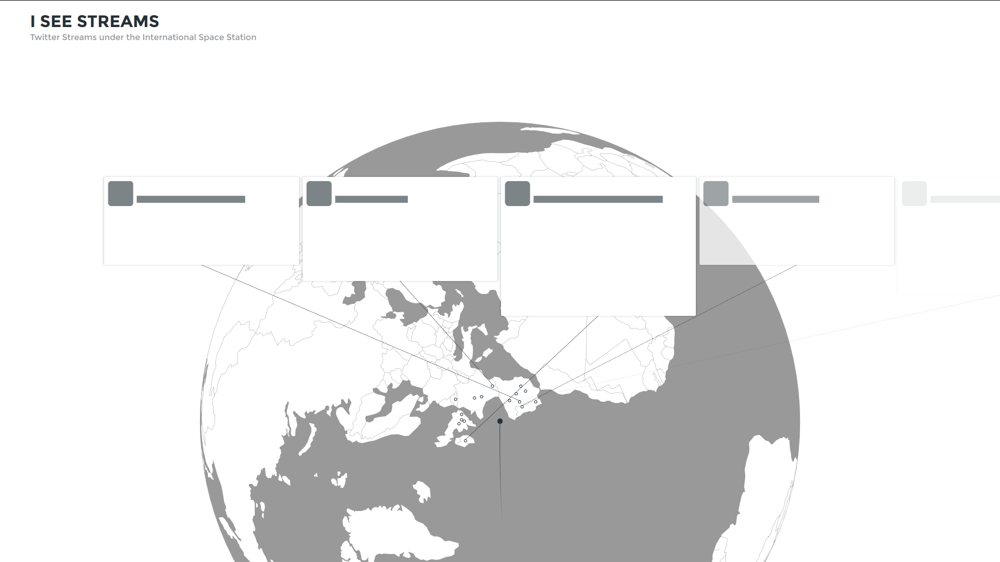

# I See Streams

[University of Applied Sciences Potsdam](http://www.fh-potsdam.de/)
Semester: Winter 2015/16
Course: [11EG-B: Eingabe/Ausgabe (Steel Ant)](https://incom.org/workspace/6176)
Supervisor: [Fabian Morón Zirfas](https://fhp.incom.org/profil/270)

This Project was realized with [Node.js](https://nodejs.org/), a JavaScript runtime, and [D3](http://d3js.org/), a JavaScript library for manipulating documents based on data, during the course *Eingabe/Ausgabe* at the *University of Applied Sciences Potsdam*.

## ISS + Twitter
Our assignment for this project was to visualize data about the [International Spacestation (ISS)](https://www.nasa.gov/mission_pages/station/main/index.html) in relation to any other data.

The ISS travels at about the speed of 7.66 km/s (27576 km/h).
What if its passengers were to only be able to read the Twitter stream live from Twitter users at the current position? 
At positions of a lot of activity, one would have to be a very quick reader to get all the information, since it would only be available for a very short time.

## Visualisation
The idea for **I See Streams** was to track the position of the ISS with the [API of open-notify.org](http://open-notify.org/Open-Notify-API/), put it in relation with live twitter activity under the ISS' position and visualize it with [D3](http://d3js.org/); More specifically D3's [geo functionalities](https://github.com/mbostock/d3/wiki/Geo).
The Globe was realized with *topoJSON* data found [here](https://github.com/mbostock/topojson/wiki/Gallery).

By positioning the ISS in the middle and rotating the earth, making it look like one were riding the Spacestation, a sense of speed can be simulated, both in travelling speed and the speed in which information disappears.

While small circles, representing currently sent tweets, appear around the ISS' position in real time these tweets also pop up at the right side of the screen, which then scroll to the top and disappear as more tweets come in.

The end result should have similarities with the following mockup image:

## Difficulties
Because of my first time using D3 (and consequently my very limited knowledge with this JS library) I was sadly dissapointed by the fact that I couldn't finish this project in time and to the extent I had initially imagined.

I managed to get the rotation of the globe, to simulate the "riding" aspect, to work and syncronize it with the data from open-notify.org. This took me quite a while though, since I had tried to output the globe in a "canvas" because of potential performance issues that could have arisen with less powerfull computers. I changed it to "SVG" because I had noticed that the amount of vectors for the globe didn't seem to lower the performance much or at all. Additionally I found working with SVG much easier.

Furthermore I found it difficult working with D3's geo functionalities since the API-Documentation was indeed complete but still confusing. Finding appropriate examples on the web wasn't easy since there weren't all too many or were too difficult for me to understand. I am for example still unable to set a dot at the right longitude and latitude coordinated on the globe to represent the current position of the ISS.

## Conclusion
In conclusion I actually found working with D3 quite fun. 
Even though I had many frustrating all nighters trying to get D3's geo functionalities to work and wasn't able to finish the project in time I'd like to think that I have learned much about working with JS, Node.js, SVG, D3, and geo-data alltogether.

I'd like to finish this project in the near future (in this form or another) but have to first better my skills to do so.