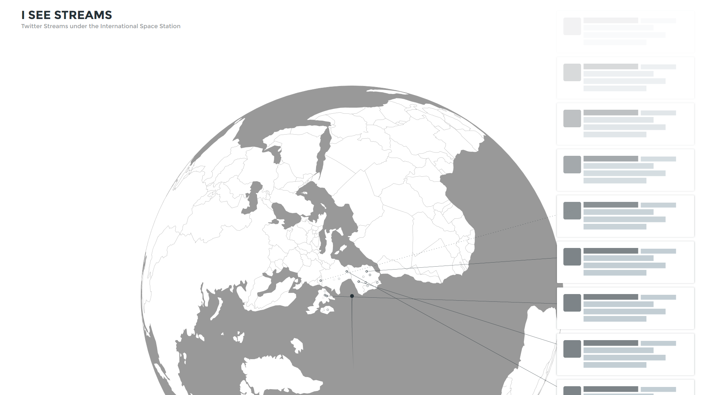

# I See Streams

[University of Applied Sciences Potsdam](http://www.fh-potsdam.de/)  
Semester: Winter 2015/16  
Course: [11EG-B: Eingabe/Ausgabe (Steel Ant)](https://incom.org/workspace/6176)  
Supervisor: [Fabian Morón Zirfas](https://fhp.incom.org/profil/270)

This Project was realized with [D3](http://d3js.org/), a JavaScript library for manipulating documents based on data, during the course *Eingabe/Ausgabe* at the *University of Applied Sciences Potsdam*.

## Beginnings
Our assignment for this project was to visualize data about the International Spacestation in relation to any other data. 

The idea for **I See Streams** was to track the position of the ISS with the [API of open-notify.org](http://open-notify.org/Open-Notify-API/), put it in relation with live twitter activity under the ISS' position and visualize it with [D3](http://d3js.org/); More specifically D3's geo functionalities.

The ISS travels at about the speed of 7.66 km/s (27576 km/h). What if its passengers were to only be able to read the Twitter stream live from Twitter users at the current position? At positions of a lot of activity, one would have to be a very quick reader to get all the information, since it would only be available for a very short time.

By positioning the ISS in the middle and turning the earth, making it look like one were riding the Spacestation, a sense of speed can be realized, both in travelling speed and the speed in which information disappears.

The end result should have similarities with the following mockup image:

